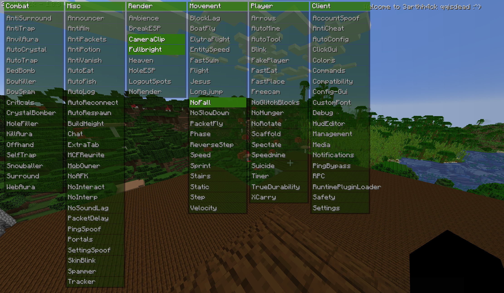
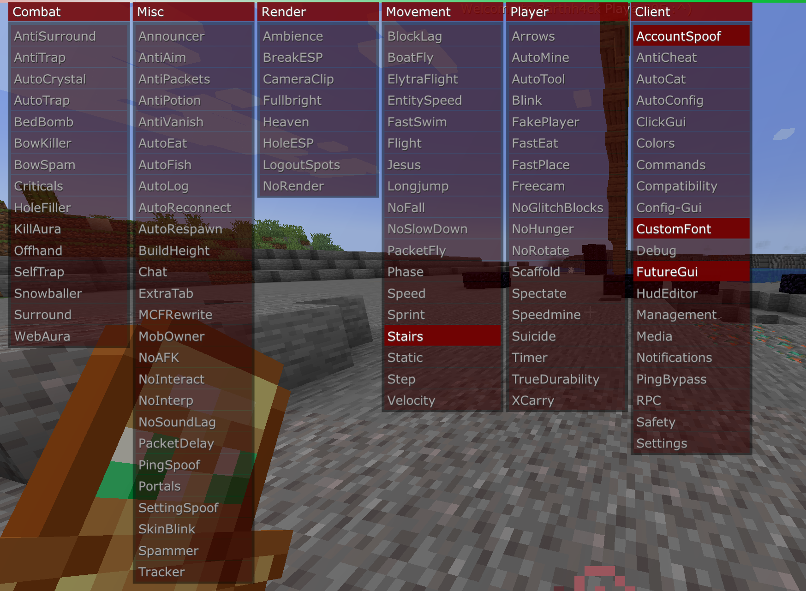

# Earthhack Plugins (1.13+)

## Plugins:

 <b>FutureGui</b>: A recreation of the Future Client new gui 

## Description

The new Future Gui, but in 3arthh4ck

## Images

## Usage

- Just load it into 3arthh4ck and click the module

## Todo

- Descriptions
- 100% accurate alpha settings
- Change the arrow animation to the new one
- Rainbow gui
- Fix category motion

## Credits and Author

The plugin was developed by [@Ai2473](https://github.com/Ai2473) and [@GentlemanMC](https://github.com/GentlemanMC). It is based on the Phobos Gui.

Thanks to [@Gopro336](https://github.com/Gopro336-2) for the Exeter 1.12.2 client https://github.com/The-Gopro336-Archive/Exeter-1.12.2

 <b>VoiceControl</b>: Control the client using your voice 

## Description

Enable and disable modules using your voice

Available commands:
- `enable` or `disable` followed by the module name
- `toggle` followed by the module name

## Usage

- Say `phobos enable autocrystal` to enable the AutoCrystal module
- Say `phobos disable surround` to disable the Surround module
- Say `phobos toggle blocklag` to toggle the KillAura module

## Todo

- Would be cool to completely control the whole client with your voice
- Make prefix changeable during runtime
- Maybe more languages

## Credits and Author

The plugin was developed by [@Ai2473](https://github.com/Ai2473).

Library used for the voice to text conversion: https://github.com/cmusphinx/sphinx4

 <b>Lawnmower</b>: Mow the lawn 

## Description

Automatically breaks grass and flowers

## Usage

- Enable the module

## Credits and Author

The plugin was developed by [@Ai2473](https://github.com/Ai2473).
This is a rewrite of the 1.12.2 Lawnmower plugin by [@3arthqu4ke](https://github.com/3arthqu4ke/3arthh4ck/tree/plugins/lawnmower)

## Installation
1. Download the plugin from the [releases page](https://github.com/3arthh4ckDevelopment/3arthh4ck-Plugins/releases)
2. Place the plugin in the `.minecraft/earthhack/plugins` folder
3. Restart the game

## Development
1. Create a plugin using the [template](https://github.com/3arthh4ckDevelopment/Plugin-Templates/tree/1.13%2B)
2. Build the plugin (remap it if you want to test it in the development environment)
3. Place the plugin in the `.minecraft/earthhack/plugins` folder
4. Restart the game

### [Go to 1.12.2 plugins](https://github.com/3arthh4ckDevelopment/3arthh4ck-Plugins/tree/1.12.2)